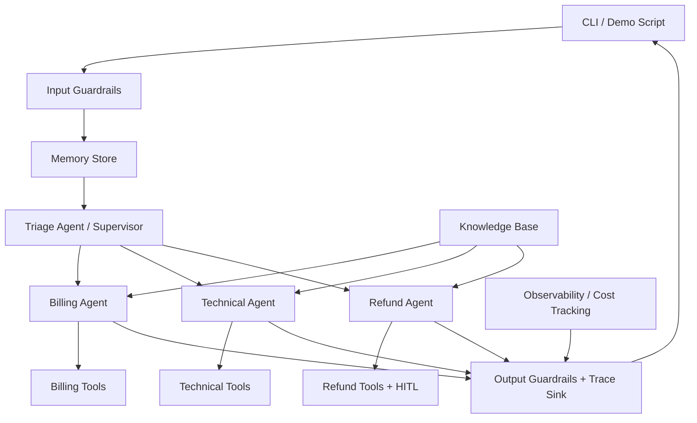

# Agentic AI Capstone: Multi-Agent Customer Support System

A production-ready customer support simulation built with **LangGraph**. The system routes inbound requests to specialist agents, keeps customer context across turns, applies safety guardrails, records traces and cost metrics, and supports human approval checkpoints for sensitive refund actions.

## Why LangGraph

LangGraph is the best fit for this capstone because the workflow has explicit state transitions, specialist routing, handoffs, and approval gates. The implementation uses a deterministic support model so the full system remains testable offline, while keeping the same state graph boundaries you would use with live LLMs in production.

## Features

- **Triage supervisor** that routes billing, technical, and refund requests.
- **Specialist agents** with domain-specific toolkits.
- **Persistent memory** keyed by customer ID with summaries and preferences.
- **Safety guardrails** for prompt injection detection and PII masking.
- **HITL refunds**: refunds above `$50` pause until approval is provided.
- **Observability** with trace events, tool logs, and estimated model costs.
- **Evaluation harness** with 20+ automated test cases and routing score checks.
- **CLI and demo script** for walkthroughs.

## Architecture Diagram



## Project Structure

```
src/customer_support_system/
├── agents/          # Supervisor and specialist agents
├── guardrails/      # Input and output safety checks
├── memory/          # Conversation persistence layer
├── tools/           # Mock external system integrations
├── cli.py           # Interactive command line experience
├── demo.py          # Scripted walkthrough for demos
├── evaluation.py    # Automated scoring helpers
├── system.py        # LangGraph workflow assembly
├── state.py         # Shared state schema
└── tracing.py       # Full trace and cost capture
```

## Setup

```bash
python3 -m venv .venv
. .venv/bin/activate
pip install -e .[dev]
```

## Run the Demo

```bash
python -m customer_support_system.demo
```

## Run the CLI

```bash
python -m customer_support_system.cli --customer-id CUST-001
```

Type `/approve` in the CLI after a refund request requiring human approval.

## Run Tests

```bash
pytest
```

## Run the Evaluation Suite

```bash
python -m customer_support_system.evaluation
```

## Framework Choice Justification

- **Explicit state graph**: agent routing, handoffs, and approval gates are first-class steps.
- **Reliable tests**: deterministic nodes allow repeatable evaluation without external APIs.
- **Scalable path**: the `DeterministicSupportModel` can be replaced by a live model adapter without changing graph topology.

## Shared State Schema

```python
class CustomerSupportState(TypedDict):
    messages: Annotated[list, add_messages]
    customer_id: str
    current_agent: str
    ticket_id: Optional[str]
    conversation_summary: str
    pending_actions: list
    guardrail_flags: list
```

## Demo Scenarios

1. Billing invoice lookup and payment history review.
2. Technical diagnostics followed by ticket creation.
3. Refund request above $50 that pauses for approval.
4. Memory recall of customer plan preference after multiple turns.

## Evaluation Targets Covered

- Routing accuracy: verified with classification fixtures in the test suite.
- Tool coverage: every specialist uses at least two tools across scenarios.
- Memory persistence: conversation context is recalled after five or more turns.
- Guardrails: prompt injection and PII masking are enforced.
- Observability: every model interaction is traced with estimated cost.

## Time-to-Merge and Iteration Metrics

Current metrics are captured in [`docs/metrics.md`](docs/metrics.md). The file is meant to be refreshed after each local evaluation run and summarizes implementation iterations, test pass counts, and evaluation scores.

## Known Limitations

- The support model is deterministic and rule-based rather than connected to a live LLM provider.
- External tools are mocked to keep the system self-contained for grading and CI.
- Cost tracking uses token estimation instead of provider billing APIs.
- Human approval is simulated through an explicit approval flag or CLI command.
