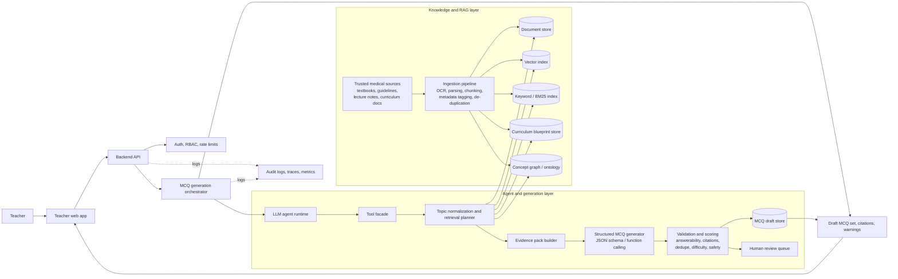

# Medical MCQ Generation System Architecture

## Goal

Teachers should be able to request a set of multiple choice questions (MCQs) for a medical subject or topic, for example:

- "Generate 10 MCQs on diabetic ketoacidosis for second-year medical students"
- "Create 5 easy questions on ECG interpretation"
- "Generate 20 exam-style questions on asthma management using guideline-based sources only"

The system should return:

- curriculum-aligned MCQs
- explanations and source citations
- a confidence and coverage signal
- a partial-result response when the system cannot safely generate the requested number of questions

## High-level architecture



## Main components

### 1. Teacher web app

The teacher submits:

- subject
- topic
- number of questions requested
- difficulty mix
- learner level
- preferred source scope, for example "internal lecture notes only" or "guidelines and textbook chapters"
- optional constraints, such as "avoid image-based questions"

The UI should display:

- generated questions
- citations for each question
- any warnings about thin evidence or topic ambiguity
- a clear partial-result message if the system could only generate fewer questions than requested

### 2. Backend API and orchestrator

The API receives the request and sends it to an orchestrator service that manages the generation workflow:

1. normalize the topic
2. retrieve evidence
3. estimate coverage
4. generate questions in a structured format
5. validate and score the result
6. return a draft set or route to human review

This orchestration layer should be deterministic and stateful. It should keep a job record with:

- request parameters
- retrieved documents and passages
- model outputs
- validation failures
- final status

### 3. Knowledge and RAG layer

The system should not let the model freely browse arbitrary web content for medical education content generation. It should rely on curated and versioned sources:

- medical textbooks
- clinical guidelines
- internal lecture notes
- official curriculum blueprints
- prior reviewed MCQs, if available

This layer should provide both semantic retrieval and exact match retrieval:

- vector search for semantic similarity
- keyword or BM25 search for precise medical terms, drug names, syndromes, and abbreviations
- concept graph lookups for topic expansion and synonym handling

### 4. Agent and generation layer

The model should be used as an agent with tightly scoped tools, not with direct database or network access. The agent's job is to:

- understand the teacher request
- decide which retrieval tools to call
- assemble an evidence pack
- generate structured MCQs using only the retrieved evidence
- ask for clarification or return a partial set when the evidence is insufficient

### 5. Validation and review

Generated MCQs should go through both deterministic and model-based validation before they are shown to a teacher:

- schema validation
- citation presence
- one correct answer only
- distractor plausibility
- duplicate detection
- evidence support check
- difficulty and taxonomy checks
- medical safety or outdated-content checks

High-risk or low-confidence sets should be routed to a human review queue.

## How I would build the RAG pipeline

The RAG pipeline should have two distinct parts: an offline indexing pipeline and an online retrieval-generation pipeline.

### A. Offline pipeline: ingestion and indexing

#### Step 1: Curate trusted medical sources

Start with sources that are institutionally approved and versioned:

- textbooks by subject and edition
- internal teaching slide decks and notes
- guideline PDFs
- course competency documents
- exam blueprints

Every source should have metadata attached:

- source id
- source type
- subject
- topic tags
- author or institution
- publication or revision date
- evidence level
- allowed usage scope

#### Step 2: Parse and clean

For each source:

- extract text from PDF, HTML, DOCX, or PPT
- run OCR where needed
- remove headers, footers, duplicate page furniture, and broken tables
- preserve section titles and hierarchy

For medicine, preserving section headings is important because headings often define the concept scope, for example:

- "Clinical features"
- "Diagnosis"
- "Contraindications"
- "Management"

#### Step 3: Chunk intelligently

Do not chunk by raw token count alone. Use structure-aware chunking:

- split by chapter, section, and subsection first
- then create chunks of roughly 300 to 700 tokens
- keep overlap small, around 50 to 100 tokens
- store parent section and source metadata

For question generation, chunk quality matters more than chunk volume. A chunk should usually contain a coherent fact pattern, not half of one table and half of another paragraph.

#### Step 4: Enrich with medical metadata

Tag chunks with:

- subject and topic
- concept ids if you have a medical ontology
- synonyms and abbreviations
- learner level if known
- source freshness

If available, map to ontology identifiers such as UMLS, MeSH, or SNOMED concept ids. This makes topic normalization and expansion much more reliable for terms like:

- MI vs myocardial infarction
- DKA vs diabetic ketoacidosis
- COPD exacerbation vs acute exacerbation of chronic obstructive pulmonary disease

#### Step 5: Build multiple retrieval indexes

Use a hybrid retrieval stack:

- **vector index** for semantic lookup of conceptually related passages
- **BM25 or keyword index** for exact terminology and abbreviations
- **document store** for fetching full surrounding context
- **concept graph** for sibling and parent topic expansion
- **curriculum store** for course objectives and expected learning outcomes

Hybrid retrieval is important in medicine because exact terms often matter a lot, but a pure keyword search can miss relevant explanatory passages.

#### Step 6: Quality checks for indexed content

Before content becomes retrievable:

- de-duplicate near-identical chunks
- reject chunks that are too short, too noisy, or OCR-corrupted
- flag stale guideline versions
- mark copyrighted or restricted documents if they cannot be quoted directly

### B. Online pipeline: retrieval and generation

#### Step 1: Normalize the teacher request

Convert the teacher request into a canonical query:

- normalize subject and topic
- map synonyms and abbreviations
- resolve ambiguity
- fetch matching curriculum objectives

Example:

- input: "heart attack complications"
- normalized topic: "myocardial infarction complications"
- concept ids: set of canonical cardiology concepts

#### Step 2: Retrieve evidence

Use multiple retrieval passes:

1. curriculum objective lookup
2. hybrid search over chunks
3. concept expansion into closely related subtopics
4. re-ranking of top passages

This should produce an **evidence pack** with:

- top passages
- source metadata
- objective coverage map
- freshness and trust score

#### Step 3: Estimate content coverage before generation

Before asking the model to write 10 questions, estimate whether the retrieved evidence can support that many unique, non-redundant questions.

Use a coverage estimator based on:

- number of unique learning objectives covered
- number of independent fact units
- diversity of source passages
- retrieval confidence

One simple rule is:

`supported_question_count = min(requested_count, unique_fact_units / 3, objective_coverage * 2)`

The exact formula can change, but the point is to prevent the generator from making up content when the evidence pack is thin.

#### Step 4: Build an evidence outline

Before full question generation, ask the model to transform the evidence pack into a structured outline:

- learning objective
- key fact
- citation
- possible question angle
- target difficulty

This is much safer than asking the model to jump directly from "topic" to "10 MCQs".

#### Step 5: Generate MCQs in a strict schema

Generate question objects only from the evidence outline, not from the full teacher prompt plus raw retrieved text. This makes grounding easier and validation simpler.

#### Step 6: Validate, repair, and return

Run validation checks. Reject or regenerate any question that fails. If the validated count is lower than requested, return:

- the supported questions
- the gap reason
- suggested next actions, such as broadening the topic or adding sources

## How I would expose tools to the AI agent

The agent should not get direct access to the vector database, SQL database, file store, or arbitrary internet browsing. Instead, expose a small set of typed tools through a controlled service layer.

### Recommended tool set

| Tool | Purpose | Typical input | Typical output | Guardrails |
|---|---|---|---|---|
| `resolve_topic` | Normalize free text into canonical medical concepts | subject, topic, learner_level | canonical topic, synonyms, concept ids, ambiguity flags | only approved ontologies |
| `get_curriculum_objectives` | Fetch learning objectives and expected difficulty | subject, topic, course_id | objective list, coverage expectations | read-only |
| `retrieve_evidence` | Hybrid search over trusted content | concept ids, keywords, source filters, top_k | cited passages with metadata and scores | trusted corpus only |
| `expand_related_topics` | Broaden or narrow the topic when evidence is thin | concept ids, expansion_mode | adjacent concepts, parent/child concepts | bounded expansion depth |
| `check_item_bank_history` | Avoid near-duplicate questions and overused stems | topic, learner_level | similar question ids and overlap score | read-only |
| `estimate_coverage` | Decide whether the evidence can support the requested count | evidence ids, requested_count | supported count, coverage score, insufficiency reason | deterministic service |
| `validate_mcq_set` | Apply schema, evidence, quality, and safety checks | draft questions, evidence ids | pass/fail per question, fix suggestions | no silent auto-publish |
| `save_draft_set` | Persist generated output for teacher review | request id, validated questions | draft set id | write-only to draft store |

### Tool-calling pattern

The agent flow should look like this:

1. call `resolve_topic`
2. call `get_curriculum_objectives`
3. call `retrieve_evidence`
4. call `estimate_coverage`
5. if coverage is low, call `expand_related_topics` and retrieve again
6. generate draft MCQs
7. call `validate_mcq_set`
8. call `save_draft_set`

### Why this tool boundary is useful

It provides:

- auditability
- tighter security
- better observability
- predictable failure handling
- easier replacement of the underlying search or storage technology later

## Structured generation of MCQs

I would use strict structured output, either JSON schema, function calling, or a Pydantic-style contract. The LLM should never return a loose paragraph that the backend later tries to parse heuristically.

### Example response schema

```json
{
  "request_id": "req_123",
  "subject": "endocrinology",
  "topic": "diabetic ketoacidosis",
  "requested_count": 10,
  "generated_count": 8,
  "status": "partial_success",
  "warnings": [
    "Only 8 well-supported questions could be generated from the available evidence."
  ],
  "questions": [
    {
      "question_id": "mcq_001",
      "learning_objective": "Recognize the biochemical features of diabetic ketoacidosis",
      "difficulty": "medium",
      "stem": "Which laboratory finding is most consistent with diabetic ketoacidosis?",
      "options": [
        {"key": "A", "text": "Metabolic alkalosis with low serum ketones"},
        {"key": "B", "text": "High anion gap metabolic acidosis with positive serum ketones"},
        {"key": "C", "text": "Normal bicarbonate with isolated hypernatremia"},
        {"key": "D", "text": "Respiratory acidosis with low glucose"}
      ],
      "correct_option": "B",
      "explanation": "DKA classically presents with high anion gap metabolic acidosis and ketonemia.",
      "citations": [
        {
          "source_id": "guideline_ada_2025",
          "section": "Diagnosis of DKA",
          "passage_id": "chunk_7781"
        }
      ],
      "confidence": 0.92
    }
  ]
}
```

### Generation stages

Use a multi-stage generation flow:

1. **Evidence outline stage**
   - produce grounded fact statements with citations
   - no full questions yet

2. **Question drafting stage**
   - generate stems, options, and explanations from the outline only
   - enforce one best answer

3. **Validation and repair stage**
   - reject unsupported or ambiguous items
   - regenerate only failed items

This staged design is better than single-pass generation because it reduces hallucinations and makes failure handling much clearer.

### Important validation rules

Every generated question should satisfy the following:

- exactly one correct answer
- distractors are plausible but clearly incorrect
- the stem is answerable using the cited evidence
- explanation agrees with the selected answer
- question is not a near-duplicate of another generated item
- question matches requested difficulty and learner level
- medical claims come from trusted, current sources

For medical education, I would also add:

- avoid unsafe or outdated clinical recommendations
- tag questions derived from older but foundational sources
- require source citation for management, drug dosing, and contraindication questions

## Failure modes and how to handle them

### 1. Not enough content to generate the requested number of MCQs

This is the failure mode you explicitly called out, and it should be treated as a first-class product behavior, not as an exception.

#### Detection

The system detects low coverage when:

- too few unique fact units are retrieved
- only one or two learning objectives are represented
- passages are repetitive or near-duplicate
- evidence scores are low
- validation rejects too many drafted questions

#### Response strategy

1. broaden retrieval slightly using related concepts
2. try alternate trusted sources
3. recalculate supported question count
4. if still low, return fewer questions instead of inventing content

#### User-facing response

Return something like:

- "Requested 10 questions; 6 could be generated with adequate evidence."
- "Reason: available content covered only diagnosis and initial management, not complications or prevention."
- "Suggested action: broaden topic to 'acute complications of diabetes' or add more source material."

This is much better than fabricating weak questions 7 to 10.

### 2. Ambiguous topic requests

Example:

- "shock"
- "heart failure"
- "stroke"

#### Handling

- use `resolve_topic`
- show clarification suggestions if ambiguity remains
- optionally generate only after the teacher confirms the intended scope

### 3. Contradictory or outdated medical sources

Example:

- lecture notes disagree with a newer guideline

#### Handling

- rank sources by trust and freshness
- prefer the latest approved guideline for management questions
- include a warning and route to review if the conflict is significant

### 4. Hallucinated or unsupported facts

#### Handling

- require citations on every item
- reject any item whose answer is not recoverable from its cited evidence
- use a validator that checks the question against the retrieved passages

### 5. Multiple correct answers or weak distractors

#### Handling

- run deterministic option checks where possible
- use an LLM-based validator to test whether distractors are distinct and incorrect
- regenerate only the bad item, not the whole set

### 6. Duplicate or overly similar questions

#### Handling

- embed generated questions and compare semantic similarity
- check against prior item bank content
- enforce a diversity constraint across objectives and question patterns

### 7. Retrieval service failure or index outage

#### Handling

- fail closed for question generation
- do not generate uncited questions
- return a retryable system error or route to manual review

### 8. Sensitive or unsafe content

#### Handling

- block generation from patient-identifying material
- avoid case stems that accidentally include PHI
- add safety filters for dosing and contraindication questions

### 9. Poor OCR or corrupted source text

#### Handling

- detect noisy chunks during ingestion
- down-rank or exclude low-quality chunks
- never cite corrupted evidence

## Recommended implementation pattern

If I were building this as a production system, I would use a simple service split:

- **Frontend**: teacher-facing web app
- **API service**: request intake, auth, job status
- **Orchestrator service**: controls the multi-step workflow
- **RAG service**: retrieval, re-ranking, evidence packing
- **Generation service**: structured LLM calls
- **Validation service**: quality and safety gates
- **Storage**: relational DB for jobs and drafts, object store for documents, vector and keyword indexes for retrieval

Possible technology choices:

- FastAPI or similar for the API layer
- PostgreSQL for relational state
- S3-compatible object storage for source documents
- pgvector, OpenSearch, or a dedicated vector database for embeddings
- OpenSearch or Elasticsearch for hybrid keyword retrieval
- a workflow engine such as Temporal, Celery, or a durable job queue

## End-to-end request flow

1. Teacher asks for 10 cardiology questions on atrial fibrillation.
2. API creates a generation job.
3. Agent resolves topic and learner level.
4. Retrieval tools gather curriculum objectives and cited passages.
5. Coverage estimator says only 7 supported questions are currently grounded.
6. Agent broadens to include diagnosis, rate control, rhythm control, and anticoagulation subtopics.
7. Retrieval runs again and now supports 10 questions.
8. Generator creates structured drafts.
9. Validator rejects 2 items for weak distractors and regenerates them.
10. Final draft set is stored and shown to the teacher with citations.

If step 7 still only supported 7 questions, the system should return 7 validated questions with a warning and suggestions.

## What matters most in this design

The most important design choice is to treat this as a **grounded content generation system**, not as a generic chatbot. That means:

- curated sources
- hybrid retrieval
- explicit tools
- strict schemas
- validation before display
- honest partial success when content is insufficient

That combination is what makes the system reliable enough for medical education use.
